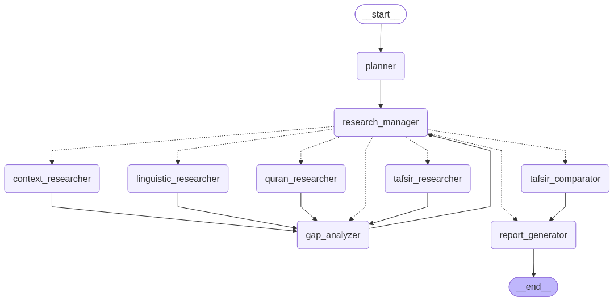

# Quran Scholar

A multi-agent system for **any Quran-related question** — not only tafsir.

The Planner builds a minimal investigation plan; specialized researchers use
[Tafsir MCP](https://tafsirmcp.netlify.app/) tools (as needed) for Quran text,
search, surah/overview/stats/qira'at, classical tafsir, linguistics, and asbab
al-nuzool. Answers stay cited instead of hallucinated.

**Examples:** thematic verses · verse lookup · tafsir / mufassir comparison ·
word roots · reasons of revelation · surah info / statistics / qira'at.

**Input:** questions in **Modern Standard Arabic**. Final report is Arabic;
`language` defaults to `ar`.

## Stack

| Layer | Role |
| --- | --- |
| **LangGraph** | Workflow orchestration (non-sequential: planner, parallel research, verify/retry) |
| **Tool agents (`*_agent`)** | Researchers only: `create_agent` + MCP tools |
| **Other LLM modules** | Planner, manager, gap, comparator, claims, verifier, report — LLM/heuristics, **no** tools |
| **Tafsir MCP** | Role toolsets (Quran meta + text, tafsir, linguistic, nuzool) — planner only schedules what the question needs |
| **Pydantic** | Structured plans, evidence, claims, verification |
| **Deterministic Python** | Validation, routing, iteration counters, state updates |

## Project layout

```
src/quran_scholar/
├── models.py       # Pydantic evidence / plan schemas
├── state.py        # Shared ResearchState for the graph
├── mcp/            # Tafsir MCP client adapter
├── graph/          # StateGraph wiring, routing, and node implementations
└── web/            # FastAPI UI (Arabic question → report)
```

## Web UI

Run the local server (loads `.env`, compiles the graph once at startup):

```bash
uv sync
uv run quran-scholar-web
```

Open [http://127.0.0.1:8765](http://127.0.0.1:8765), type your question in Arabic, and submit. The page shows the final Arabic report and any warnings.

Options: `uv run quran-scholar-web --port 8080 --reload`

## Setup

Requires Python **≥ 3.12** (Tafsir MCP dependency).

```bash
cp .env.example .env   # add OPENAI_API_KEY (and optional LangSmith / MCP settings)
uv sync
```

### Tafsir MCP

Default: remote Streamable HTTP endpoint (no local DB install required):

```env
TAFSIR_MCP_URL=https://mcp.tafsir.net/mcp
```

Tools are wrapped in `src/quran_scholar/mcp/client.py` as LangChain tools
(`fetch_ayah`, `fetch_tafsir`, `search_quran_text`, …).


## System architecture

```
┌─────────────────────────────────────────────────────────────────┐
│  Web UI (FastAPI)  ← Arabic question → الإجابة + الأدلة         │
└────────────────────────────┬────────────────────────────────────┘
                             │ invoke(ResearchState)
                             ▼
┌─────────────────────────────────────────────────────────────────┐
│                     LangGraph StateGraph                        │
│                                                                 │
│  START → Planner → Research Manager ──┬──► Quran Researcher ─┐  │
│                    ▲                  ├──► Tafsir Researcher ┼──┤
│                    │                  ├──► Linguistic Res.   ┘  │
│                    │                  └──► Context Researcher ─┤
│                    │                         │                  │
│                    └──────── Gap Analyzer ◄──┘                  │
│                    │                                            │
│                    ├──► (optional) Tafsir Comparator ──┐        │
│                    └──► Report Generator ──────────────┴► END   │
└─────────────────────────────────────────────────────────────────┘
                             │
                             ▼
              Tafsir MCP (HTTP) — role-scoped tools via create_agent
```

**Shared state:** one `ResearchState`. Nodes return only fields they change. Evidence lists append across iterations.

**External services:** LLM (OpenAI-compatible / OpenRouter); Tafsir MCP for retrieval.

Wired in `src/quran_scholar/graph/builder.py`.

Compiled graph diagram:



Regenerate:

```bash
uv run python -c "
from pathlib import Path
from quran_scholar.graph import build_graph
Path('docs/quran_scholar_graph.png').write_bytes(
    build_graph().get_graph().draw_mermaid_png()
)
"
```

### Node responsibilities

| Node | Responsibility |
| --- | --- |
| **Planner** | Minimal research plan (which evidence types / tasks). Does not answer. |
| **Research Manager** | Next researcher wave(s), optionally parallel; then gap / comparison / finish. |
| **Quran Researcher** | Text + meta MCP tools (`fetch_ayah`, search, surah info, stats, qira'at, …). |
| **Tafsir Researcher** | Classical commentary **when planned**. |
| **Linguistic Researcher** | Word/root study **when planned**. |
| **Context Researcher** | Asbab al-nuzool **when planned**. |
| **Gap Analyzer** | Deterministic sufficiency check vs the plan; always returns to the manager. |
| **Tafsir Comparator** | **Optional** — only if manager chooses `comparison`. |
| **Report Generator** | Final Arabic **الإجابة** + **الأدلة** from collected evidence. |

### Routing (short)

- **Research Manager is the only router** for next work: researcher(s), gap analysis, optional comparison, or finish (report).
- **After Gap Analyzer:** always back to the manager (which then decides loop / comparison / finish).

Smoke test (node state updates log via `quran_scholar.graph.nodes`; report prints at the end):

```bash
uv run python -c "
import logging
from quran_scholar.graph import build_graph
from quran_scholar.state import initial_research_state
logging.basicConfig(level=logging.INFO, format='%(message)s')
out = build_graph().invoke(initial_research_state('ما تفسير آية الكرسي؟'))
print(out.get('final_report') or '')
"
```

## Design notes

- One shared `ResearchState`; nodes return **only** fields they change.
- Append reducers on evidence lists so iterations cannot wipe prior work.
- Researcher nodes use LLM + MCP tools; planner/manager/gap/report use LLM or heuristics without tools.
- Research loops via gap analyzer until the plan is satisfied or `max_research_iterations` is hit.

## Attribution

Quranic data via Tafsir MCP is **CC BY 4.0** — attribute [Tafsir Center for Quranic Studies](https://tafsir.net).
